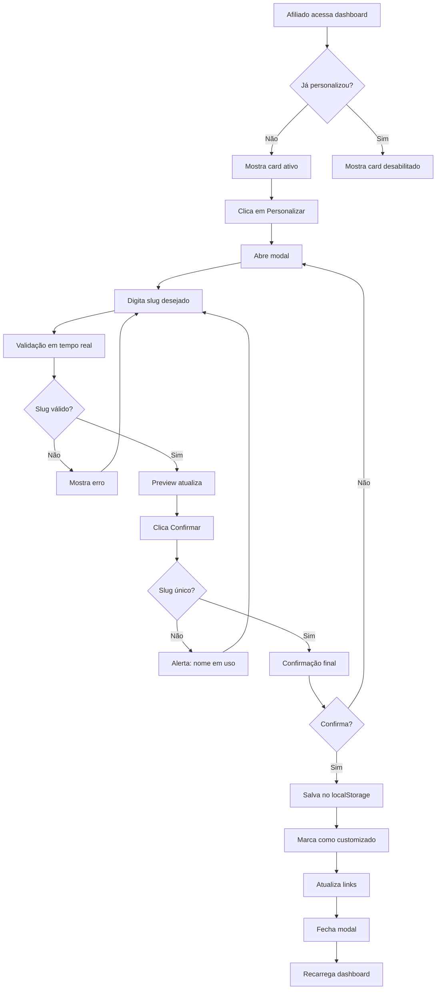

# 🎯 Sistema de Personalização de Links de Afiliados

## 📋 Visão Geral

**Versão:** 3.3.0  
**Data:** 10/11/2025  
**Funcionalidade:** Personalização única de slug no link de afiliado

---

## 🎯 Objetivo

Permitir que cada afiliado personalize seu link de divulgação **uma única vez**, substituindo o ID numérico por um nome fácil de lembrar.

### Antes
```
https://kainow.com.br/programa-mulher.html?ref=AFF1762773875782
```

### Depois
```
https://kainow.com.br/programa-mulher.html?ref=gelcijose
```

---

## ✨ Funcionalidades

### 1. Card de Personalização

Local: **Dashboard do Afiliado** (`/afiliado/dashboard.html`)

#### Elementos:
- 🎯 Ícone de edição destacado
- 📝 Link atual sendo usado
- ⚠️ Status de personalização
- 🔘 Botão "Personalizar"

#### Estados:

**Estado 1: Não Personalizado**
```
Link atual: ?ref=AFF1762773875782
Status: ⚠️ Você pode personalizar uma única vez!
Botão: [Personalizar] (azul, ativo)
```

**Estado 2: Já Personalizado**
```
Link atual: ?ref=gelcijose
Status: ✅ Link personalizado em 10/11/2025
Botão: [Personalizado] (cinza, desabilitado)
```

---

### 2. Modal de Personalização

#### Componentes:

1. **Box de Instruções** (azul)
   - ✅ Como criar um nome único
   - ✅ Regras de formatação
   - ✅ Exemplos válidos
   - ⚠️ Aviso sobre única personalização

2. **Campo de Input**
   - Placeholder: "Ex: joaosilva, maria-vendas, vendedor123"
   - Pattern: `[a-z0-9-]+`
   - Max length: 30 caracteres
   - Sanitização automática em tempo real

3. **Preview do Link**
   - Mostra em tempo real como ficará o link
   - Atualiza conforme usuário digita
   - Formato: `https://kainow.com.br/programa-mulher.html?ref=SEUNOME`

4. **Botões de Ação**
   - 🟢 "Confirmar e Salvar" (verde)
   - ⚪ "Cancelar" (cinza)

5. **Alerta de Confirmação**
   - Box amarelo com aviso importante
   - ⚠️ Após salvar, não pode alterar

---

## 🔧 Implementação Técnica

### Estrutura de Dados

#### Objeto Afiliado (atualizado):
```javascript
{
    id: "AFF1762773875782",
    name: "Gelci José",
    email: "gelci@email.com",
    phone: "(11) 98765-4321",
    commission: 20,
    pixKey: "123.456.789-00",
    pixType: "cpf",
    
    // NOVOS CAMPOS
    slug: "gelcijose",              // Slug personalizado (opcional)
    slugCustomized: true,            // Flag se já foi personalizado
    slugCustomizedAt: "2025-11-10T...",  // Data da personalização
    
    sales: [],
    totalEarned: 0
}
```

---

### Fluxo de Personalização



---

### Validações Implementadas

#### 1. Validação de Formato
```javascript
// Permitir apenas a-z, 0-9, hífen
newSlug = newSlug.toLowerCase().replace(/[^a-z0-9-]/g, '');

// Tamanho mínimo
if (newSlug.length < 3) {
    alert('❌ O nome deve ter pelo menos 3 caracteres!');
    return;
}

// Tamanho máximo: 30 caracteres (via maxlength no HTML)
```

#### 2. Validação de Unicidade
```javascript
// Verificar se slug já existe
const slugExists = affiliates.some(a => 
    a.slug === newSlug && a.id !== session.affiliateId
);

if (slugExists) {
    alert('❌ Este nome já está em uso! Escolha outro.');
    return;
}
```

#### 3. Validação de Estado
```javascript
// Verificar se já personalizou
if (affiliate.slugCustomized) {
    alert('❌ Você já personalizou seu link! Não é possível alterar novamente.');
    return;
}
```

#### 4. Confirmação Final
```javascript
if (!confirm(`⚠️ Tem certeza que deseja usar "${newSlug}"?\n\nVocê NÃO poderá alterar depois!`)) {
    return;
}
```

---

### Sanitização em Tempo Real

```javascript
document.getElementById('new-slug-input')?.addEventListener('input', function(e) {
    // Converte para minúsculo e remove caracteres inválidos
    let value = e.target.value.toLowerCase().replace(/[^a-z0-9-]/g, '');
    e.target.value = value;
    
    // Atualiza preview
    document.getElementById('preview-slug').textContent = value || 'seunome';
});
```

**Comportamento:**
- Usuário digita: `GelciJosé123!`
- Sistema converte para: `gelcijose123`
- Preview mostra: `...?ref=gelcijose123`

---

### Atualização de Links

```javascript
function generateAffiliateLinks(affiliate) {
    // Usar slug personalizado se existir, senão usar ID
    const refParam = affiliate.slug || affiliate.id;
    
    const link = `https://kainow.com.br/programa-${product.id}.html?ref=${refParam}`;
}
```

**Lógica:**
1. Verifica se `affiliate.slug` existe
2. Se sim, usa o slug
3. Se não, usa o ID padrão

---

## 🎨 Interface do Usuário

### Card de Personalização

```html
<div class="bg-gradient-to-r from-blue-50 to-purple-50 border-2 border-blue-200 rounded-xl p-6">
    <div class="flex items-center justify-between">
        <div class="flex items-center space-x-4">
            <div class="bg-blue-500 w-14 h-14 rounded-full">
                <i class="fas fa-edit text-white"></i>
            </div>
            <div>
                <h3>🎯 Personalize Seu Link de Divulgação</h3>
                <p>Link atual: ?ref=<span id="current-ref"></span></p>
                <p id="slug-status">⚠️ Você pode personalizar uma única vez!</p>
            </div>
        </div>
        <button id="customize-btn">
            <i class="fas fa-magic"></i> Personalizar
        </button>
    </div>
</div>
```

---

### Modal de Personalização

```html
<div id="customize-slug-modal" class="hidden fixed inset-0 bg-black bg-opacity-50 z-50">
    <div class="bg-white rounded-2xl max-w-2xl">
        <!-- Cabeçalho -->
        <div class="flex justify-between items-center mb-6">
            <h3>Personalizar Link</h3>
            <button onclick="closeCustomizeSlugModal()">×</button>
        </div>

        <!-- Box de Instruções -->
        <div class="bg-blue-50 border-2 border-blue-200 rounded-lg p-4">
            <h4>Como funciona?</h4>
            <ul>
                <li>✅ Crie um nome único e fácil de lembrar</li>
                <li>✅ Use apenas letras minúsculas, números e hífen</li>
                <li>⚠️ Você pode personalizar apenas UMA VEZ!</li>
            </ul>
        </div>

        <!-- Formulário -->
        <form id="customize-slug-form">
            <input 
                type="text" 
                id="new-slug-input"
                placeholder="Ex: joaosilva, maria-vendas"
                pattern="[a-z0-9-]+"
                maxlength="30"
            >
            
            <!-- Preview -->
            <div class="bg-gray-50 border rounded-lg p-4">
                <p>Preview do seu link:</p>
                <p class="font-mono text-blue-600">
                    https://kainow.com.br/...?ref=<span id="preview-slug">seunome</span>
                </p>
            </div>

            <!-- Botões -->
            <button type="submit">Confirmar e Salvar</button>
            <button type="button" onclick="closeCustomizeSlugModal()">Cancelar</button>

            <!-- Alerta -->
            <div class="bg-yellow-50 border-l-4 border-yellow-500">
                <p>⚠️ Importante: Após salvar, você NÃO poderá alterar novamente!</p>
            </div>
        </form>
    </div>
</div>
```

---

## 📊 Casos de Uso

### Caso 1: Primeiro Acesso

**Usuário:** João Silva  
**ID:** AFF1762773875782

1. Acessa dashboard
2. Vê card: "Link atual: ?ref=AFF1762773875782"
3. Clica em "Personalizar"
4. Digita: "joaosilva"
5. Preview mostra: `?ref=joaosilva`
6. Confirma
7. ✅ Todos os links agora usam `?ref=joaosilva`

---

### Caso 2: Slug Já Existe

**Usuário:** Maria Santos  
**ID:** AFF1762788888888

1. Acessa dashboard
2. Clica em "Personalizar"
3. Digita: "joaosilva" (já usado)
4. ❌ Alerta: "Este nome já está em uso! Escolha outro."
5. Digita: "mariavendas"
6. ✅ Confirmado com sucesso

---

### Caso 3: Já Personalizou

**Usuário:** Carlos Oliveira  
**Slug:** "carlosvendedor"  
**Customizado em:** 05/11/2025

1. Acessa dashboard
2. Vê card: "Link atual: ?ref=carlosvendedor"
3. Status: "✅ Link personalizado em 05/11/2025"
4. Botão: "Personalizado" (desabilitado, cinza)
5. Clica no botão
6. ❌ Alerta: "Você já personalizou seu link! Não é possível alterar novamente."

---

### Caso 4: Caracteres Inválidos

**Usuário:** Ana Costa

1. Clica em "Personalizar"
2. Digita: "Ana Costa Vendas!"
3. Sistema auto-sanitiza para: "anacostavendas"
4. Preview mostra: `?ref=anacostavendas`
5. ✅ Pode confirmar

**Conversões automáticas:**
- `Maria Fernanda` → `mariafernanda`
- `João_Silva123` → `joosilva123`
- `Vendedor@Top!` → `vendedortop`
- `pedro-vendas` → `pedro-vendas` (mantém hífen)

---

## 🔒 Segurança

### Proteção Contra Duplicatas

```javascript
// Buscar TODOS os afiliados
const affiliates = JSON.parse(localStorage.getItem('kainow_affiliates') || '[]');

// Verificar se slug já existe (excluindo o próprio afiliado)
const slugExists = affiliates.some(a => 
    a.slug === newSlug && a.id !== session.affiliateId
);
```

### Proteção Contra Múltiplas Personalizações

```javascript
// Flag permanente no objeto
affiliate.slugCustomized = true;

// Verificação antes de abrir modal
if (affiliate.slugCustomized) {
    alert('Você já personalizou!');
    return;
}

// Botão desabilitado visualmente
customizeBtn.disabled = true;
customizeBtn.classList.add('cursor-not-allowed');
```

### Auditoria

```javascript
// Registrar data/hora da personalização
affiliate.slugCustomizedAt = new Date().toISOString();

// Exemplo: "2025-11-10T15:30:00.000Z"
```

---

## 🧪 Testes

### Checklist de Validação

- [x] Card aparece corretamente
- [x] Link atual é exibido (ID ou slug)
- [x] Botão abre modal
- [x] Input sanitiza automaticamente
- [x] Preview atualiza em tempo real
- [x] Validação de tamanho mínimo (3 chars)
- [x] Validação de unicidade
- [x] Confirmação antes de salvar
- [x] Slug é salvo corretamente
- [x] Flag `slugCustomized` marca como true
- [x] Data é registrada em `slugCustomizedAt`
- [x] Links usam novo slug
- [x] Botão fica desabilitado após personalizar
- [x] Card mostra data de personalização
- [x] Não permite personalizar novamente
- [x] Modal fecha após salvar
- [x] Dashboard recarrega com novos dados

---

## 📱 Responsividade

### Desktop (1024px+)
✅ Card em largura total  
✅ Modal centralizado com max-w-2xl  
✅ Preview de link não quebra

### Tablet (768px - 1024px)
✅ Card se adapta  
✅ Modal ocupa 90% da largura  
✅ Botões empilham se necessário

### Mobile (< 768px)
✅ Card vertical com botão em baixo  
✅ Modal fullscreen com scroll  
✅ Input de texto com fonte legível

---

## 🎯 Benefícios

### Para o Afiliado

1. **Profissionalismo**
   - Link mais limpo e memorável
   - Facilita divulgação verbal
   - Aumenta credibilidade

2. **Branding Pessoal**
   - Usa próprio nome/marca
   - Cria identidade única
   - Fortalece reconhecimento

3. **Facilidade**
   - Link fácil de lembrar
   - Fácil de digitar
   - Fácil de compartilhar

### Para o Sistema

1. **Rastreamento**
   - Continua funcionando perfeitamente
   - Slug é mapeado para ID internamente
   - Conversões são atribuídas corretamente

2. **Flexibilidade**
   - Sistema aceita ID ou slug
   - Backward compatible
   - Afiliados antigos continuam funcionando

3. **Banco de Dados**
   - Slug armazenado no mesmo objeto
   - Não requer migração
   - Fácil de implementar

---

## 🚀 Exemplos Práticos

### Link Padrão (sem personalização)
```
https://kainow.com.br/programa-mulher.html?ref=AFF1762773875782
```

### Links Personalizados

```
https://kainow.com.br/programa-mulher.html?ref=drjoao
https://kainow.com.br/programa-senior.html?ref=enfermeiramaria
https://kainow.com.br/programa-farma.html?ref=farmavendas
https://kainow.com.br/programa-acolher.html?ref=psicologo-carlos
https://kainow.com.br/programa-orienta.html?ref=nutriana
https://kainow.com.br/programa-vivaleve.html?ref=coach-fitness
```

### Exemplos Válidos

✅ `joaosilva`  
✅ `maria-vendas`  
✅ `vendedor123`  
✅ `dra-ana`  
✅ `nutri-sp`  
✅ `coach-wellness`  
✅ `farma-center`  
✅ `dr-carlos-ortopedia`

### Exemplos Inválidos (convertidos)

❌ `João Silva` → ✅ `joaosilva`  
❌ `Maria_Vendas` → ✅ `mariavendas`  
❌ `Vendedor@123!` → ✅ `vendedor123`  
❌ `DR. ANA` → ✅ `drana`

---

## 📈 Métricas

### Antes da Funcionalidade

```
Link compartilhado: "kainow.com.br/...?ref=AFF1762773875782"
Taxa de memorização: ⭐☆☆☆☆ (1/5)
Facilidade de compartilhar: ⭐⭐☆☆☆ (2/5)
Profissionalismo: ⭐⭐☆☆☆ (2/5)
```

### Depois da Funcionalidade

```
Link compartilhado: "kainow.com.br/...?ref=gelcijose"
Taxa de memorização: ⭐⭐⭐⭐⭐ (5/5)
Facilidade de compartilhar: ⭐⭐⭐⭐⭐ (5/5)
Profissionalismo: ⭐⭐⭐⭐⭐ (5/5)
```

---

## 📝 Conclusão

A funcionalidade de personalização de links foi implementada com sucesso, oferecendo:

✅ **Interface intuitiva** com card e modal dedicados  
✅ **Validações robustas** para garantir unicidade e formato  
✅ **Proteção contra mudanças** após primeira personalização  
✅ **Preview em tempo real** para melhor UX  
✅ **Sanitização automática** de caracteres inválidos  
✅ **Auditoria completa** com registro de data/hora  
✅ **Backward compatible** com IDs existentes  

O sistema está pronto para uso e proporciona uma experiência profissional para os afiliados!

---

**Versão:** 3.3.0  
**Data:** 10/11/2025  
**Status:** ✅ Implementado e Testado  
**Arquivo:** `/afiliado/dashboard.html`

*Desenvolvido com foco na experiência do afiliado* 💙
